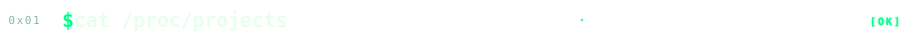
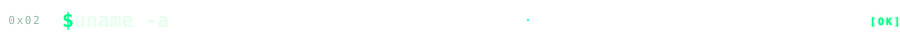
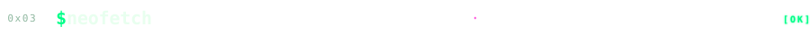
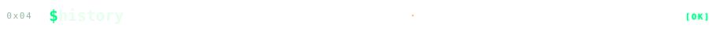
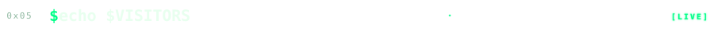

<div align="center">


<a href="https://git.io/typing-svg"></a>

</div>




<table align="center" width="100%">
<tr>
<td width="50%" align="center">
  <a href="https://github.com/wheregoes/byd-dolphin-hacking"></a>
</td>
<td width="50%" align="center">
  <a href="https://github.com/wheregoes/byd-apps"></a>
</td>
</tr>
</table>




<div align="center">


</div>




<div align="center">


</div>




<div align="center">

<picture>
  <source media="(prefers-color-scheme: dark)" srcset="https://raw.githubusercontent.com/wheregoes/wheregoes/output/github-snake-dark.svg" />
  <source media="(prefers-color-scheme: light)" srcset="https://raw.githubusercontent.com/wheregoes/wheregoes/output/github-snake.svg" />
  
</picture>

</div>




<div align="center">

```sh
[visitor@wheregoes ~]$ echo $VISITORS
```


</div>



<div align="center">

<sub>built with <code>$vim</code> · <code>$coffee</code> · <code>$insomnia</code></sub>

</div>
