<div align="center">



<a href="https://git.io/typing-svg"></a>

</div>


### `$ cat /proc/projects`

<div align="center">

| | |
|:---|:---|
| [`byd-dolphin-hacking`](https://github.com/wheregoes/byd-dolphin-hacking) | Reverse engineering BYD Dolphin head unit — CAN bus, AVAS, NFC, OTA |
| [`byd-apps`](https://github.com/wheregoes/byd-apps) | Custom Android apps for BYD vehicles — door sounds, CAN bus tools |

</div>


### `$ uname -a`

<div align="center">


</div>


### `$ neofetch`

<div align="center">


</div>


### `$ history`

<div align="center">

<picture>
  <source media="(prefers-color-scheme: dark)" srcset="https://raw.githubusercontent.com/wheregoes/wheregoes/output/github-snake-dark.svg" />
  <source media="(prefers-color-scheme: light)" srcset="https://raw.githubusercontent.com/wheregoes/wheregoes/output/github-snake.svg" />
  
</picture>

</div>


<div align="center">

```
[visitor@wheregoes ~]$ echo $VISITORS
```


</div>
